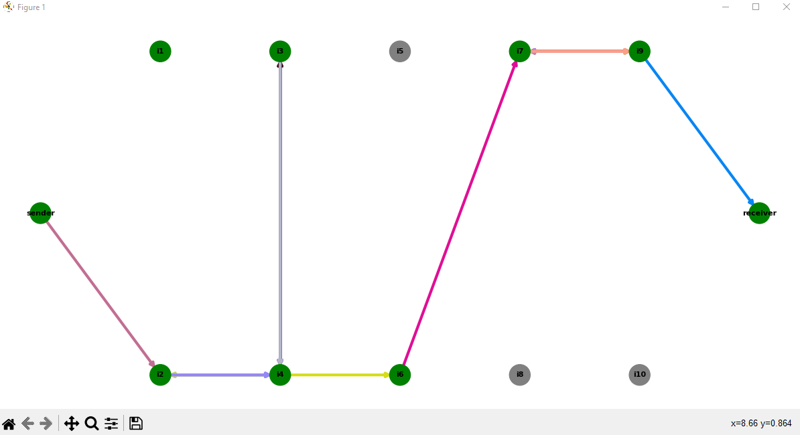
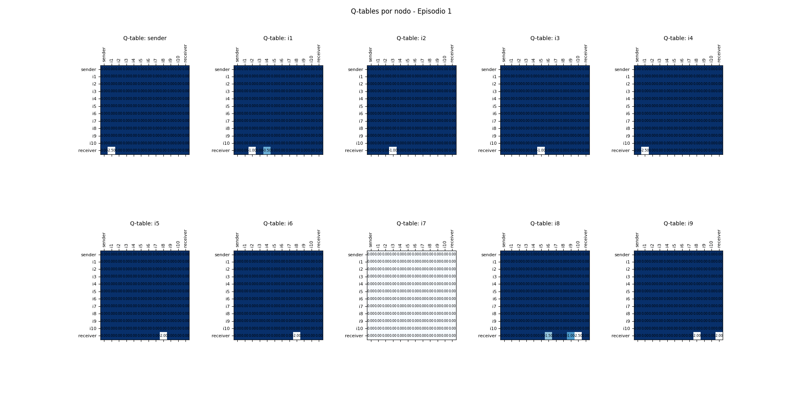

# Dynamic Network Routing with Q-Learning

This project implements a dynamic routing system in a simulated network using Q-Learning. The goal is to simulate the transmission of a packet from a `sender node` to a `receiver node` while learning the most efficient route through intermediate nodes. This simulation adapts to changes in the network topology due to node disconnection and reconnection, optimizing the route by minimizing the number of hops and processing time at each node.



Each episode in the simulation allows the network to learn and improve routing decisions by updating a Q-table based on the reward obtained at each hop. The system uses an epsilon-greedy algorithm for exploration and exploitation of available routes, dynamically adjusting to network failures and reconnections.

## How the Learning Works

### Step-by-Step Process:

1. **Network Setup**:
   - The network consists of 12 nodes: 1 `sender`, 1 `receiver`, and 10 intermediate nodes (`i1` to `i10`).
   - Each node has predefined neighbors, and their positions are fixed in a 2D space.

2. **Q-Learning Initialization**:
   - Each node has a Q-table that stores Q-values for possible actions (hopping to neighboring nodes).
   - The Q-learning parameters include learning rate (`alpha`), discount factor (`gamma`), and exploration rate (`epsilon`).
   - A reward system is implemented based on the time taken by each node to process and forward the packet.

3. **Packet Transmission**:
   - In each episode, the `sender` node attempts to send a packet to the `receiver` node.
   - At each step, the current node uses its Q-table to choose the next hop based on the available neighbors.
   - The system balances exploration (randomly choosing a neighbor with probability `epsilon`) and exploitation (choosing the neighbor with the highest Q-value).

4. **Node Disconnections**:
   - Intermediate nodes can disconnect and reconnect randomly, simulating real-world network instabilities.
   - The network updates the status of each node dynamically, and nodes that are offline cannot participate in the routing process.

5. **Q-Table Updates**:
   - After each hop, the Q-value for the action taken is updated based on the reward received and the future expected reward.
   - The reward for each hop is based on the processing time of the node. If the packet reaches the receiver, a final reward is applied.

6. **Visualization**:
   - Each episode is visualized as a directed graph where nodes and their connections are drawn. Nodes are colored based on their status (active or inactive), and the packet's path is highlighted.
   - The Q-tables are also visualized after each episode to show the learning progress.



### Network Animation:
The simulation also provides an animated visualization of the packet's path through the network in each episode, highlighting the selected route with random colors for each hop.

## Q-Value Calculation

The Q-value for a given state-action pair `(s, a)` is updated using the **Bellman equation**:

This is represented as:

$$
Q(s, a) \leftarrow Q(s, a) + \alpha \left[ r + \gamma \max_{a'} Q(s', a') - Q(s, a) \right]
$$

Where:
- $Q(s, a)$ is the current Q-value of taking action $a$ in state $s$.
- $\alpha$ is the **learning rate**, which controls how much new information overrides the old information.
- $r$ is the **reward** received after taking the action.
- $\gamma$ is the **discount factor**, which determines how much future rewards are considered.
- $\max_{a'} Q(s', a')$ is the maximum predicted Q-value for the next state $s'$ after taking action $a$.

This formula ensures that the Q-value reflects both the immediate reward and the estimated future rewards. The update process moves the Q-value towards the optimal expected total reward over time.


### Understanding the Bellman Equation

The Bellman equation is fundamental in reinforcement learning because it expresses the relationship between the current Q-value and the future Q-values. In essence, it breaks down the decision-making process into two parts:
1. **Immediate Reward (`r`)**: This is the reward the agent receives after performing an action.
2. **Future Reward (`max_{a'} Q(s', a')`)**: This is the best possible reward the agent can achieve in the future, starting from the next state.

By combining these two terms, the algorithm learns not only from the immediate feedback but also takes into account how future decisions will affect the overall outcome.

## Simulation Workflow

Here’s a breakdown of the simulation workflow:

- **Initialization**: The network, Q-tables, and parameters are initialized.
- **Packet Sending**: In each episode, the sender tries to deliver a packet to the receiver, learning the optimal path through the network.
- **Node Status Updates**: Nodes can disconnect and reconnect randomly during the simulation.
- **Q-Table Updates**: The Q-table for each node is updated based on the reward received for each hop.
- **Visualization**: After each episode, the network topology and Q-tables are visualized and saved as images.

### Parameters

- **alpha** (learning rate): 0.5
- **gamma** (discount factor): 0.9
- **epsilon** (exploration rate): 0.1

## Running the Simulation

To run the simulation, follow these steps:

1. **Ensure Required Libraries**:
   - The simulation uses the following Python libraries: `numpy`, `matplotlib`, `networkx`, and `os`. Install them via `pip` if needed:
     ```bash
     pip install numpy matplotlib networkx
     ```

2. **Execute the Script**:
   - Run the main script to execute the simulation for a specified number of episodes. The default is 1000 episodes:
     ```bash
     python simulation.py
     ```

3. **Output**:
   - The simulation will generate two types of visual outputs for each episode:
     - A visualization of the network and the path taken by the packet.
     - The Q-tables for each node, showing the learned Q-values after the episode.
   - All images will be saved in the `simulation_images/` directory.

## Next Steps

- **Test with Different Parameters**: Experiment with different values for `alpha`, `gamma`, and `epsilon` to observe how they affect the learning process.
- **Increase Network Size**: Add more nodes and neighbors to simulate a larger network and observe the system's performance.
- **Implement More Complex Reward Structures**: Introduce new factors into the reward function, such as packet loss penalties or traffic congestion costs.
